# 全球机场巴士信息(Global Airport Bus Information)

按 国家 / 城市 / 机场 搜索全球机场巴士信息;含用户系统(注册/登录/个人中心/收藏/站内信/建议工单)、界面多语言、以及管理后台。订阅(收藏)的巴士信息更新时,通过站内信及时推送。

## 实现过程(AI Vibe Coding)

本项目全程用 [Claude Code](https://claude.com/claude-code)(Opus)以 vibe coding 方式构建,配合 [superpowers](https://github.com/obra/superpowers) 与 gstack 技能栈,按「先想清楚、再设计、后实现」的顺序推进:

1. **头脑风暴与需求** — `superpowers:brainstorming` 厘清意图、范围与边界。
2. **系统设计** — 产出 [docs/design.md](docs/design.md),经多 agent 对抗评审(gstack 的 CEO / 工程经理 / 设计 / DX 等视角 + `autoplan` 四阶段)反复打磨,所有修订以编号评审日志(`E*`/`D*`/`DS*`/`EN*`)留痕。
3. **高保真设计稿(Frontend Design)** — 在 [design/](design/) 完成 8 页生产级 HTML/CSS 稿,经 `frontend-design` + gstack 设计工具生成、`plan-design-review` 多轮评审(含对比度达 WCAG AA、44px 触控目标、骨架与卡片对齐等修复)。`design/styles.css` 作为前端样式 **tokens 单一事实源**,实现期复制为 `frontend/src/styles/tokens.css`,Vue 组件直接复用其 class。
4. **实施计划** — `superpowers:writing-plans` 把「查询主线」拆成 19 个 **TDD bite-sized** 任务([docs/superpowers/plans/](docs/superpowers/plans/)),每个任务自带可运行代码、验证命令与提交点。
5. **实现** — `superpowers:subagent-driven-development`:每个任务派发**全新上下文的子代理**实现,严格 **TDD(先写失败测试 red → 实现 green)**,实现后过**两阶段评审**(先 spec 合规、再代码质量;核心任务用更强模型 opus 深评)。评审抓出并修复了多处真实问题(Redis 缓存命中 500、charset 混淆、`@MapperScan` 切片回归、NFC 测试缺口等)。
6. **收尾** — 整体 final code review 确认集成一致性与可合并性,再用 `superpowers:finishing-a-development-branch` 合并。

> 截至当前全量:后端 35 个测试类(含 23 个 Testcontainers 真 MySQL/Redis 集成测试 `*IT`)、前端 32 个测试 + 类型检查零错通过;`docker compose up` 一键起全栈端到端验证。

## 技术栈

- 前端:Vue 3 + TypeScript + Vite + Element Plus + Pinia + vue-i18n + TanStack Query
- 后端:Spring Boot 3 + Spring MVC + MyBatis(模块化单体)
- 数据库:MySQL 8;缓存:Redis
- 数据源:维也纳、上海两市,用 [data.json](https://github.com/fupengfei/Global-Airport-Bus-Information/blob/main/data.json) 初始化(服务端抓取延后)

## 文档

- 设计文档:[docs/design.md](docs/design.md)(纯设计层,不含数据库 schema;经多 agent 对抗评审修订)

数据库 schema 不在设计文档内,留待实现环节(基于 design.md「系统核心数据结构」落地)。

## Quickstart(本地一键起)

```bash
cp .env.example .env
docker compose up -d --build      # mysql + redis + 后端 + 前端
# 前端: http://localhost:8081
# 后端 API: http://localhost:8080/api/v1/tree
# Swagger: http://localhost:8080/swagger-ui/index.html
```

种子数据(维也纳/上海)在后端首启时幂等导入(`SEED_ENABLED=true`)。

### 用户系统(注册 / 登录 / 找回密码)

- **种子管理员**:首启在 `SEED_ENABLED=true` 下幂等建一个 SUPER_ADMIN,账号密码**打印在后端控制台**(默认 `admin` / `admin12345`,可用 `airportbus.seed.admin-username` / `airportbus.seed.admin-password` 覆盖)。
- **邮件(验证码 / 重置链接)默认走 dev 控制台**:不配 SMTP 时,注册验证码与找回密码重置链接**打印到后端控制台**(`==== DEV MAIL ====`),本地无需真实邮箱即可走通注册/找回。配置 `spring.mail.host` 等即自动切换为真实 SMTP 发送。
- 鉴权:JWT(短期 access + 可撤销 refresh,刷新轮换);登录失败 Redis 限流;查询主线仍全程零登录。
- 端点前缀 `/api/v1/auth/*`(register/login/refresh/logout/password),个人中心 `/api/v1/me`。前端页:`/login`、`/reset-password`、`/me`。

### 本地开发(热重载)

```bash
docker compose up -d mysql redis           # 只起依赖(宿主端口 3307 / 6380,避开本机已有的 MySQL/Redis)
cd backend && SPRING_PROFILES_ACTIVE=local mvn spring-boot:run   # :8080,local profile 已指向 3307/6380 + 开启种子导入
cd frontend && npm install && npm run dev   # :5173,已配 /api 代理到 :8080
```

> 注意:后端默认 profile 连 3306;本地用 Docker 起的 MySQL 暴露在 **3307**,所以本地开发必须带 `SPRING_PROFILES_ACTIVE=local`(无 `mvnw`,用系统 `mvn`,需 Java 21)。
>
> 跑测试:`mvn test`(单测)/ `mvn test -Dtest='*IT'`(Testcontainers 集成测试,需 Docker)/ 前端 `npm test`。

## 下一步

详见 design.md 的 The Assignment。实现第一步:基于「系统核心数据结构」设计具体 schema + 写幂等种子导入器,把维也纳/上海两城数据导入并跑通查询主线。

## 产品预览

### 前台预览

| | |
|---|---|
| 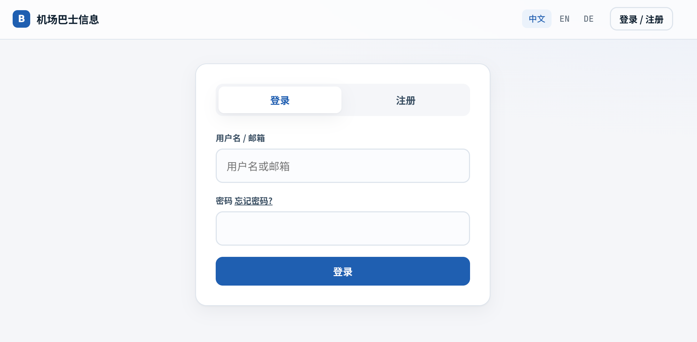<br>**登录**:支持用户名/邮箱,邮箱找回密码 | 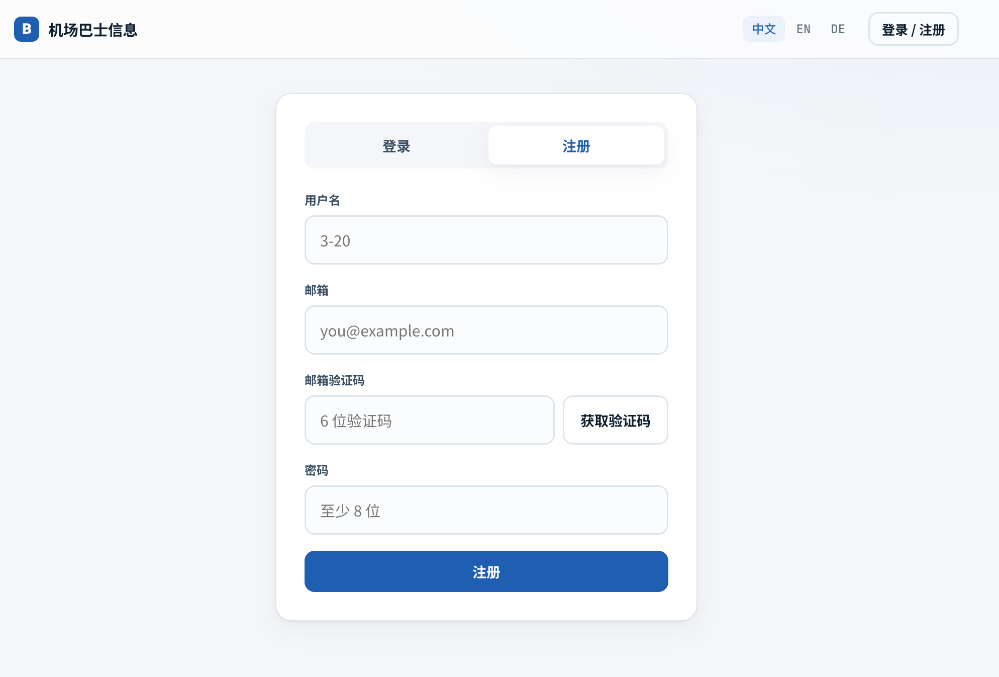<br>**注册**:邮箱验证码 |
| 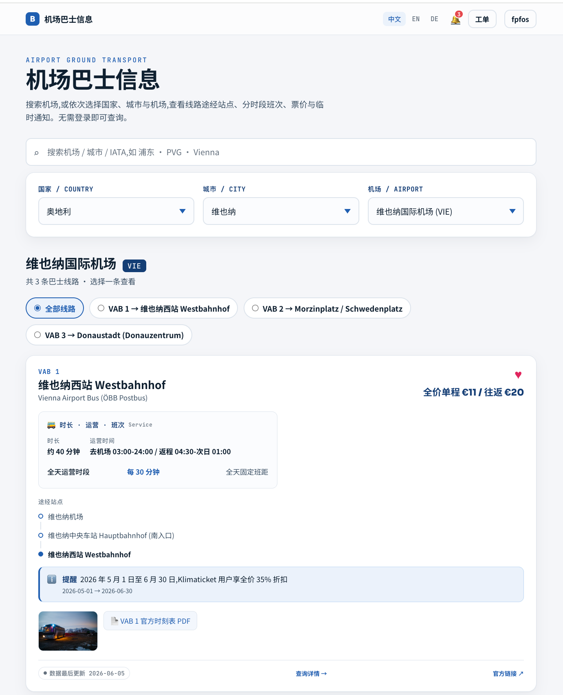<br>**首页 · 机场查询(零登录)**:搜索 + 国家/城市/机场三级选择 + 统一巴士卡片 | 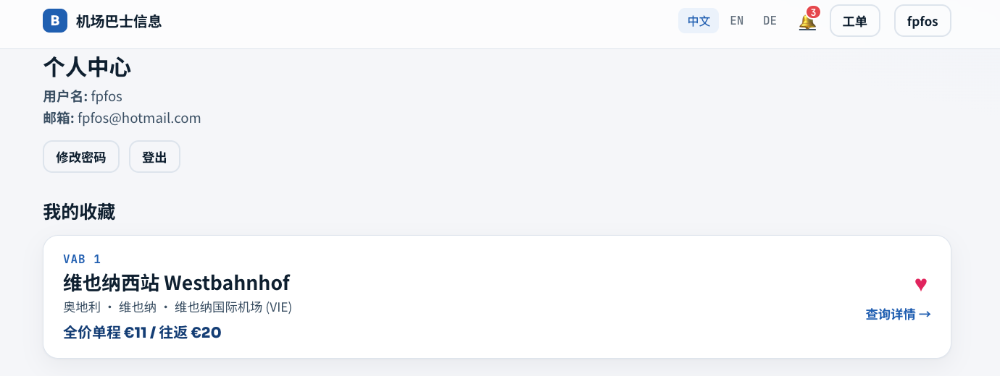<br>**个人中心 · 我的收藏**:缩减卡(国家·城市·机场),点卡进详情 |
| 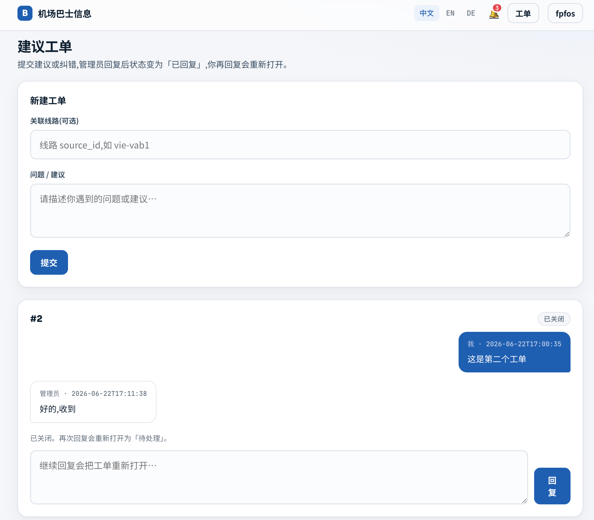<br>**建议工单**:用户 ↔ 管理员,状态机流转 | 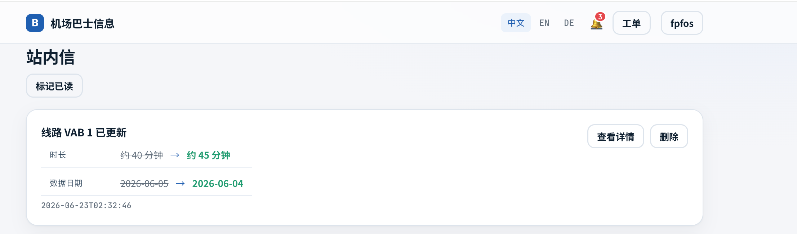<br>**站内信 · 变更推送**:订阅线路更新时字段级 diff 推送 |

### 管理台预览

| | |
|---|---|
| 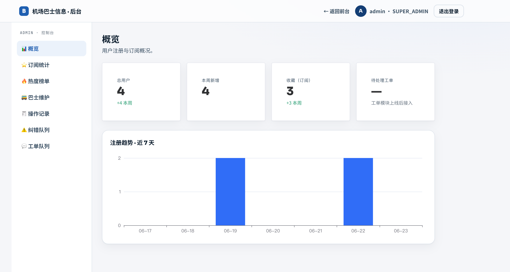<br>**后台 · 概览**:用户注册与订阅概况 | 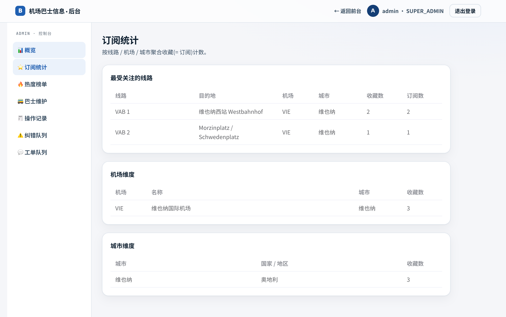<br>**后台 · 订阅统计**:按线路/机场/城市聚合 |
| 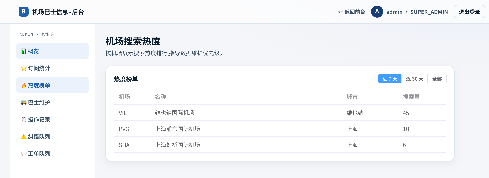<br>**后台 · 搜索热度**:机场搜索热度榜单 | 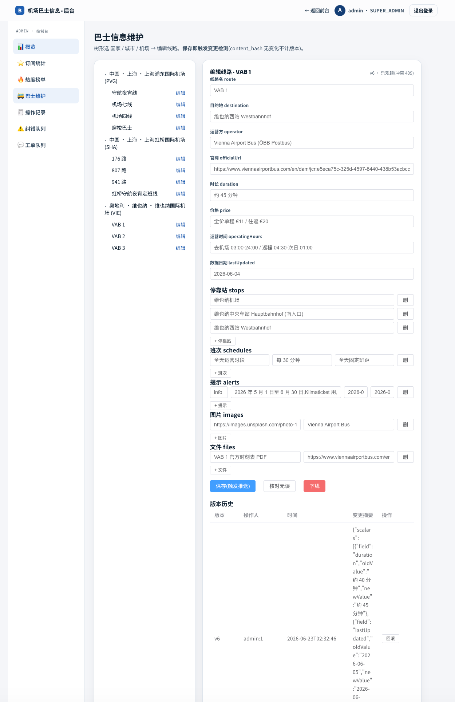<br>**后台 · 巴士信息维护**:树形选取 + 全子表编辑,保存触发变更检测 |
| 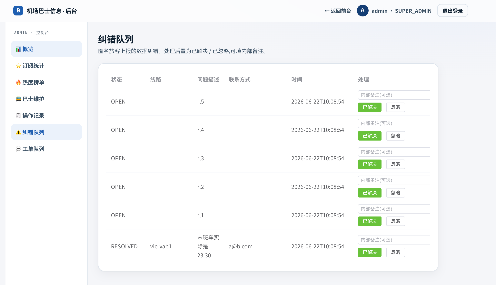<br>**后台 · 纠错队列**:匿名纠错上报处理 | 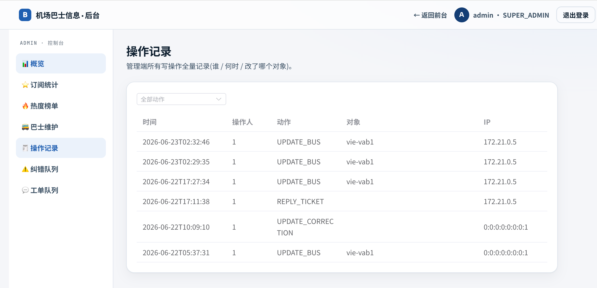<br>**后台 · 操作记录**:管理操作审计日志 |
| 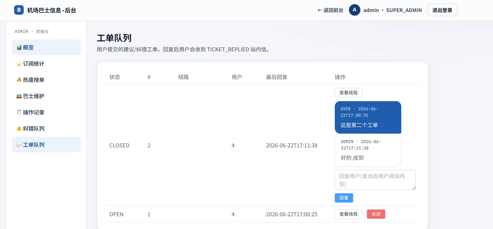<br>**后台 · 工单队列**:用户工单处理 | |
